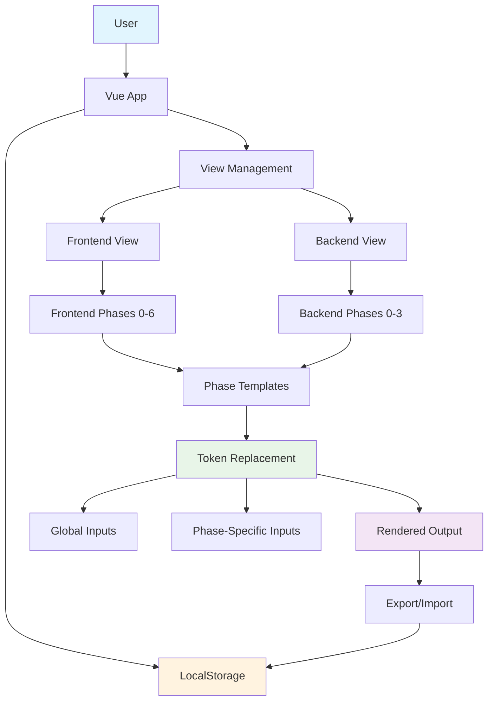
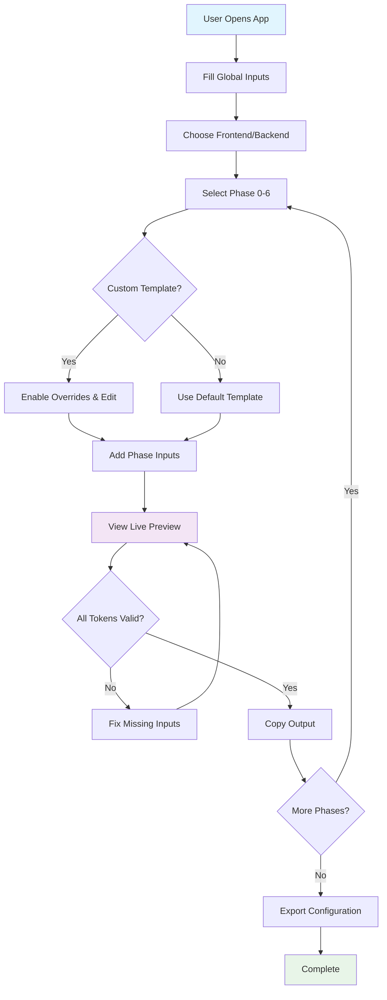
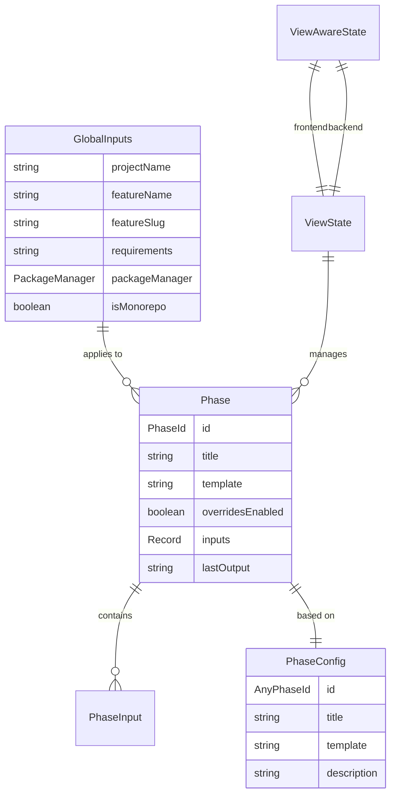

# Comprehensive Repository Analysis

## 1. System Overview

### Apps/Packages and Interactions

This repository contains a **single Vue.js application** for building and managing project documentation prompts across multiple development phases. The system follows a **composable-based architecture** with clear separation of concerns.



### Key Runtime Flows

#### 1. Application Initialization

```
User loads app → LocalStorage check → View-aware state restoration → Default phase selection
```

#### 2. Phase Management Flow

```
User selects phase → Phase config loaded → Template rendered → User edits → Auto-save to localStorage
```

#### 3. Token Replacement Flow

```
Global inputs + Phase inputs → Replacement map → Template processing → Rendered output
```

#### 4. View-Aware Navigation

```
User switches view (Frontend/Backend) → View state loaded → Phase list updated → UI refreshed
```

### Packages & Responsibilities

| Package                         | Purpose                      | Ownership     | Key Exports                          |
| ------------------------------- | ---------------------------- | ------------- | ------------------------------------ |
| `/apps/builder`                 | Main Vue.js application      | Frontend Team | `Phase`, `GlobalInputs`, composables |
| `/apps/builder/src/config`      | Phase configurations & types | Product Team  | `PhaseConfig`, phase templates       |
| `/apps/builder/src/composables` | Business logic layer         | Frontend Team | `usePhases`, `useReplacements`       |
| `/apps/builder/src/components`  | UI components                | Frontend Team | Vue components                       |
| `/apps/builder/src/utils`       | Utility functions            | Frontend Team | Validation, token parsing            |

## 2. Public Surfaces per Package (R-004/R-022)

### Core Application (`/apps/builder`)

**Public APIs & Exported Types:**

```typescript
// Core domain types (R-004)
export interface Phase {
  id: PhaseId;
  title: string;
  template: string;
  overridesEnabled: boolean;
  inputs: Record<string, string>;
  lastOutput: string;
}

export interface GlobalInputs {
  projectName: string;
  featureName: string;
  featureSlug: string;
  requirements: string;
  packageManager: PackageManager;
  isMonorepo: boolean;
}

// View-aware types for frontend/backend split
export type ViewType = "frontend" | "backend";
export type AnyPhaseId = PhaseId | BackendPhaseId;
```

**Composable APIs:**

```typescript
// Phase management (R-007-R-011)
export function usePhases(
  phases: PhaseMap,
  globalInputs: GlobalInputs
): {
  currentPhaseId: Ref<PhaseId>;
  getPhase: (id: PhaseId) => Phase;
  updatePhase: (id: string, updates: Partial<Phase>) => void;
  phasesList: ComputedRef<Phase[]>;
  currentPhase: ComputedRef<Phase>;
  hasUnsavedChanges: ComputedRef<boolean>;
};

// Token replacement system
export function useReplacements(
  globalInputs: GlobalInputs,
  phaseInputs: Record<string, string>
): {
  replacementMap: ComputedRef<ReplacementMap>;
  replaceTokens: (template: string) => string;
  getAvailableTokens: () => string[];
  validateTokens: (template: string) => ValidationResult;
};
```

**Patterns & Anti-patterns:**

✅ **Good Patterns (R-002, R-021, R-023):**

- Composable-based state management with clear separation
- Immutable updates using object spread
- One-way data flow: composables → components
- Precise TypeScript typing with exhaustive unions
- Component composition over inheritance

❌ **Anti-patterns:**

- Direct localStorage manipulation without error handling (R-017)
- Missing error boundaries for critical surfaces (R-017)
- No loading states for async operations (R-029)
- Hardcoded phase lists instead of configuration-driven (R-021)

### Configuration Layer (`/apps/builder/src/config`)

**Public APIs:**

```typescript
// Phase configuration (R-004/R-022)
export interface PhaseConfig {
  id: AnyPhaseId;
  title: string;
  template: string;
  description: string;
}

// Unified phase access
export function getPhaseConfig(id: AnyPhaseId): PhaseConfig;

// Type-safe phase configurations
export const PHASE_CONFIGS: Record<PhaseId, PhaseConfig>;
export const BACKEND_PHASE_CONFIGS: Record<BackendPhaseId, PhaseConfig>;
```

## 3. Developer View

### Code Style & Module Structure (R-021)

- **Framework**: Vue 3 with Composition API
- **Language**: TypeScript with strict mode enabled (R-005)
- **Styling**: SCSS with component-scoped styles (R-026)
- **Architecture**: Feature-based organization with one-way imports

**Directory Structure:**

```
apps/builder/src/
├── components/          # UI layer (presentational)
├── composables/         # Business logic layer
├── config/             # Configuration & types
├── pages/              # Route components
├── types/              # Shared type definitions
├── utils/              # Pure utility functions
└── styles/             # Global styles
```

### State Management & Hooks Discipline (R-007–R-011)

**State Architecture:**

```typescript
// Centralized state via composables (R-007-R-009)
const storage = usePhaseBuilderStorage(); // localStorage persistence
const viewManagement = useViewManagement(storage); // view switching
const phases = useViewAwarePhases(viewState, currentView, globalInputs); // phase logic
```

**Hook Patterns:**

- ✅ All hooks called at top level (R-007)
- ✅ Complete dependency arrays (R-007)
- ✅ Minimal state with derived computations (R-009)
- ✅ No direct Effects - only for external system sync (R-008)
- ✅ Stable unique keys for lists (R-010)

### i18n Usage (R-018)

❌ **Not implemented** - Application is English-only with hardcoded strings

### Routing/Data Boundaries (R-028)

❌ **No routing** - Single-page application with phase-based navigation

- Data fetching handled in composables layer
- UI components receive typed data/handlers as props

### Testing/A11y Posture (R-012–R-016)

**Testing Framework:**

- **Tool**: Vitest + @testing-library/vue (R-014)
- **Setup**: jsdom environment with proper configuration
- **Coverage**: No coverage enforcement currently configured
- **A11y**: jest-axe available but not systematically used (R-013)

**Test Organization:**

```
src/
├── __tests__/          # Integration tests
├── components/__tests__/ # Component tests
├── composables/__tests__/ # Logic tests
└── utils/__tests__/    # Utility tests
```

**Current Test Coverage:**

- ✅ Utility functions (validation, token parsing)
- ✅ Composable logic (useReplacements, useValidation)
- ✅ Component behavior testing
- ❌ Missing a11y smoke tests (R-013)
- ❌ No coverage targets enforced (R-015)

### Performance Notes (R-016)

**Current State:**

- ✅ Computed properties for efficient reactivity
- ✅ No heavy work in render functions
- ❌ No memoization evidence (none needed currently)
- ❌ No bundle size monitoring
- ❌ LocalStorage size limits not enforced

## 4. Product View

### Current Features & Primary User Workflows

**Core Features:**

1. **Multi-Phase Project Management**: 8 frontend phases (0-6) + 4 backend phases
2. **Template System**: Customizable templates with `[TOKEN]` replacement
3. **Global Inputs**: Project metadata (name, feature, owner, stack, requirements)
4. **Phase-Specific Inputs**: Custom inputs per phase
5. **Live Preview**: Real-time template rendering
6. **Export/Import**: JSON-based configuration sharing
7. **View-Aware Interface**: Separate frontend/backend workflows
8. **Local Persistence**: Automatic localStorage sync

**Primary User Workflows:**



### Domain Entities + Key Business Rules

**Core Entities:**



**Key Business Rules:**

1. **Phase IDs**: Fixed sets - Frontend: "0"|"1"|"2"|"2.5"|"3"|"4"|"5"|"6", Backend: "backend-0"|"backend-1"|"backend-2"|"backend-3"
2. **Token Format**: `[TOKEN_NAME]` with uppercase underscore convention
3. **Template Override**: Must explicitly enable custom templates per phase
4. **Persistence**: All changes auto-save to localStorage with view-aware structure
5. **Export Format**: JSON with metadata (version, exportedAt, currentView)
6. **Token Precedence**: Phase inputs override global inputs for same token names
7. **View Isolation**: Frontend and backend phases maintain separate state

## 5. Risks & Tech Debt

### Performance Risks

- **LocalStorage Growth**: No size limits or cleanup strategy for accumulated data
- **Template Rendering**: No memoization for complex template processing
- **Large Export Files**: No chunking for export/import operations
- **Memory Leaks**: Potential issues with localStorage watchers

### Developer Experience (DX)

- **Limited Development Tools**: Missing Vue DevTools integration
- **Build Optimization**: No bundle analysis or code splitting
- **Hot Reload**: Basic Vite setup without advanced HMR configuration

### Accessibility Risks (R-012–R-013)

- **Missing A11y Tests**: No systematic jest-axe integration
- **Color Contrast**: Not validated against WCAG 2.1 AA standards
- **Keyboard Navigation**: Limited testing coverage for complex interactions
- **Screen Reader Support**: No comprehensive testing with assistive technologies

### Boundary Leaks (R-002, R-017)

- **Global State Pollution**: No isolation between different projects in localStorage
- **Error Handling**: No centralized error boundary for unhandled exceptions
- **Validation Gaps**: Limited input validation and sanitization
- **Component Coupling**: Some components directly access global state

### Flaky Tests

- **LocalStorage Interference**: Tests may affect each other's storage state
- **Async Operations**: Limited testing of localStorage persistence timing
- **Component Mocking**: Heavy mocking may hide real integration issues

### Security & Secrets Posture (R-020)

✅ **Good:**

- No secrets in codebase
- Client-side only application
- No external API calls

❌ **Risks:**

- No input validation/sanitization
- LocalStorage data not encrypted
- No XSS protection for user-generated templates

### Technical Debt

1. **Missing Error Boundaries**: Unhandled exceptions crash entire app (R-017)
2. **Limited Validation**: Minimal input validation and error states (R-020)
3. **No Loading States**: Poor UX for async operations (R-029)
4. **Hardcoded Configuration**: Phase lists not easily extensible
5. **Data Migration**: No versioning strategy for localStorage schema changes
6. **Missing i18n**: No internationalization support (R-018)
7. **Bundle Size**: No optimization or analysis tools
8. **A11y Gaps**: Missing systematic accessibility testing (R-013)

## 6. Constraints & Guardrails (Affirmed)

### Do-Not-Touch (DN-T) Files - VERBATIM FROM REPO_CONSTRAINTS.md

**CRITICAL: These files/folders require RFC + explicit human approval. AI MUST NOT modify them under any circumstances.**

Do-Not-Touch (DN-T) Files & Folders
Edits to anything below require an RFC + explicit human approval. AI MUST NOT modify these.
Package & Workspaces:
package.json, lockfiles (pnpm-lock.yaml, package-lock.json, yarn.lock), pnpm-workspace.yaml
TS/JS Project Config:
tsconfig*.json, jsconfig*.json
Build/Tooling Config:
next.config._ (and any framework build config), babel.config._, .babelrc, vite.config._, rollup.config._, tsup.config._, webpack.config._, postcss.config._, tailwind.config._, Emotion/Babel plugins config, Storybook config (.storybook/**)
Lint/Format/Editor:
.eslintrc*, .prettierrc*, .stylelint*, .lintstagedrc*, .commitlintrc\*, .editorconfig
VCS / CI / Hooks:
.gitignore, .gitattributes, .mailmap, .husky/, .github/** (workflows), .gitlab-ci.yml, .circleci/, turbo.json, nx.json
Infra / DevOps:
Dockerfile*, docker-compose*, kubernetes/, terraform/, infra/_
Testing Runners:
playwright.config._, vitest.config._, jest.config._, cypress.config._
Dependency Mgmt:
dependabot.yml, renovate.json, .npmrc, .nvmrc
IDE / Project Meta:
.vscode/, .idea/
Env & Secrets:
.env_, .env._.example, config/.env._
Other root-level dotfiles & configs:
any .\* at repo root not explicitly listed above
No exceptions: DN-T edits land only via an approved RFC PR authored/approved by a human.

### AI Compliance Affirmation

**No DN-T file will be modified during implementation.** All infrastructure and configuration changes will require RFC proposals and explicit human approval per R-001/R-031.

### Foreseeable Blockers Requiring RFC

#### 1. **A11y Testing Infrastructure** (R-013)

**Blocker**: Need jest-axe integration for accessibility testing  
**RFC Required**: Add `jest-axe` dependency and configure systematic a11y testing  
**RULESET Reference**: R-013 (A11y tests required)  
**Impact**: Would require updating `package.json` and `vitest.config.ts`

#### 2. **Code Coverage Enforcement** (R-015)

**Blocker**: No coverage targets configured  
**RFC Required**: Configure coverage thresholds (Lines ≥ 85%, Branches ≥ 80%)  
**RULESET Reference**: R-015 (Coverage posture)  
**Impact**: Would require updating `vitest.config.ts`

#### 3. **Bundle Analysis & Optimization** (R-016)

**Blocker**: No build optimization or bundle analysis  
**RFC Required**: Add bundle analysis tools and optimization strategies  
**RULESET Reference**: R-016 (Performance sanity)  
**Impact**: Would require updating `vite.config.ts` and build scripts

#### 4. **Prettier Integration** (R-024)

**Blocker**: No code formatting enforcement  
**RFC Required**: Add Prettier configuration and pre-commit hooks  
**RULESET Reference**: R-024 (No eslint-disable without RFC)  
**Impact**: Would require adding `.prettierrc` and updating `package.json`

#### 5. **CI/CD Pipeline** (R-025)

**Blocker**: No automated testing or deployment
**RFC Required**: GitHub Actions workflow for testing, linting, and deployment  
**RULESET Reference**: R-025 (PR hygiene)  
**Impact**: Would require creating `.github/workflows/` directory

#### 6. **Error Boundary Implementation** (R-017)

**Blocker**: No centralized error handling  
**RFC Required**: Implement Vue error boundaries and error reporting  
**RULESET Reference**: R-017 (Boundaries/fallbacks)  
**Impact**: Application-level changes only (no DN-T files affected)

## 7. Appendix

### Environment Variables

**None currently used** - Application is client-side only with no external dependencies

### Key Scripts

| Command          | Purpose                  | Notes                        |
| ---------------- | ------------------------ | ---------------------------- |
| `pnpm dev`       | Start development server | Vite dev server with HMR     |
| `pnpm build`     | Build for production     | Vue-tsc + Vite build         |
| `pnpm preview`   | Preview production build | Vite preview server          |
| `pnpm test`      | Run tests in watch mode  | Vitest with jsdom            |
| `pnpm test:ui`   | Run tests with UI        | Vitest UI interface          |
| `pnpm test:run`  | Run tests once           | CI-friendly test run         |
| `pnpm typecheck` | TypeScript checking      | vue-tsc --noEmit             |
| `pnpm lint`      | ESLint with auto-fix     | Flat config with Vue support |

### How to Run: Lint / Typecheck / Test / Build / A11y Smoke

```bash
# Development workflow
pnpm install           # Install dependencies
pnpm dev              # Start dev server (http://localhost:5173)

# Quality checks
pnpm lint             # ESLint (auto-fix enabled)
pnpm typecheck        # TypeScript validation
pnpm test             # Unit tests (watch mode)
pnpm test:run         # Unit tests (CI mode)

# Production build
pnpm build            # Build for production
pnpm preview          # Preview build locally

# A11y smoke testing (manual - no automation yet)
# 1. Open app in browser
# 2. Use keyboard navigation (Tab, Enter, Escape)
# 3. Test with screen reader (VoiceOver/NVDA)
# 4. Validate color contrast manually
```

### Conventions Quick-Ref (R-021)

**Folder Structure:**

```
src/
├── components/      # UI components (presentational)
├── composables/     # Business logic (reusable)
├── config/         # Configuration & phase definitions
├── pages/          # Route-level components
├── types/          # Shared TypeScript definitions
├── utils/          # Pure utility functions
└── styles/         # Global SCSS styles
```

**File Naming:**

- Components: `PascalCase.vue` (e.g., `PhaseView.vue`)
- Composables: `camelCase.ts` with `use` prefix (e.g., `usePhases.ts`)
- Types: `camelCase.ts` (e.g., `index.ts`)
- Utils: `camelCase.ts` (e.g., `validation.ts`)

**Test Colocation:**

- Component tests: `components/__tests__/ComponentName.spec.ts`
- Composable tests: `composables/__tests__/useComposable.spec.ts`
- Utility tests: `utils/__tests__/utilityName.spec.ts`
- Integration tests: `__tests__/feature.spec.ts`

**Public API Exports:**

- Each directory has `index.ts` for public API surface (R-004/R-022)
- Export both values and types at boundaries
- Prefer union types over enums for public APIs

---

**Document Version**: 1.0  
**Generated**: 2025-10-02  
**Status**: Complete
**Next Steps**: Use this analysis to guide implementation decisions and RFC creation
