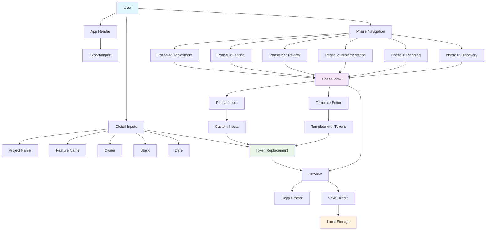

# Comprehensive Repository Analysis

## System Overview

### Architecture

The prompt builder is a **single-page Vue.js application** designed for creating and managing project documentation across multiple phases. The system follows a **composable-based architecture** with clear separation of concerns.

### Key Runtime Flows

#### 1. **Application Initialization**

```
User loads app → LocalStorage check → Default state restoration → Phase 0 (Discovery) selected
```

#### 2. **Phase Management Flow**

```
User selects phase → Phase data loaded → Template rendered → User edits → Auto-save to localStorage
```

#### 3. **Token Replacement Flow**

```
Global inputs + Phase inputs → Replacement map → Template processing → Rendered output
```

#### 4. **Export/Import Flow**

```
Export: Current state → JSON serialization → File download
Import: File upload → JSON parsing → State restoration → UI update
```

### System Dependencies



## Packages & Responsibilities

### `/apps/builder` - Main Application

**Purpose**: Single Vue.js application for prompt building

**Public APIs**:

- `Phase` interface - Core phase data structure
- `GlobalInputs` interface - Global project inputs
- `usePhases()` composable - Phase management logic
- `useReplacements()` composable - Token replacement system
- `useLocalStorage()` composable - Persistence layer

**Key Components**:

- `App.vue` - Root application component
- `Index.vue` - Main page layout
- `PhaseView.vue` - Individual phase editor
- `PhaseNavigation.vue` - Phase selection
- `GlobalInputs.vue` - Global input form
- `PhasePreview.vue` - Rendered output display

**Patterns**:
✅ **Good**: Composable-based state management
✅ **Good**: TypeScript strict typing
✅ **Good**: Component composition over inheritance
✅ **Good**: Single responsibility principle

**Anti-patterns**:
❌ **Issue**: Direct localStorage manipulation without error handling
❌ **Issue**: No centralized error boundary
❌ **Issue**: Missing loading states for async operations

## Developer View

### Code Style & Module Structure

- **Framework**: Vue 3 with Composition API
- **Language**: TypeScript with strict mode
- **Styling**: SCSS with BEM methodology
- **Architecture**: Feature-based organization
- **State Management**: Composable pattern (no Pinia/Vuex)

### State Management

```typescript
// Centralized state via composables
const storage = usePhaseBuilderStorage(); // localStorage persistence
const phases = usePhases(storage.value.phases, storage.value.globalInputs);
const replacements = useReplacements(globalInputs, phaseInputs);
```

**State Flow**:

1. **Global State**: `PhaseBuilderState` interface
2. **Persistence**: Automatic localStorage sync
3. **Reactivity**: Vue 3 reactive system
4. **Updates**: Immutable patterns with object spread

### Internationalization (i18n)

❌ **Not implemented** - Application is English-only

### Routing

❌ **No routing** - Single-page application with phase-based navigation

### Testing & Accessibility Posture

#### Testing Framework

- **Unit Testing**: Vitest + @testing-library/vue
- **Coverage**: 4 test files, 17 tests passing
- **Test Structure**: Component and composable testing
- **Mocking**: Component mocking with vi.mock()

#### Accessibility (a11y)

**Current State**:
✅ **Implemented**:

- ARIA labels on form inputs
- `aria-current="page"` on active navigation
- `aria-pressed` on toggle buttons
- Focus management with CSS
- Screen reader utilities (`.sr-only`)

❌ **Missing**:

- Keyboard navigation testing
- Color contrast validation
- Screen reader testing
- ARIA live regions for dynamic content

#### Coverage Analysis

```
Current: 17 tests passing
Target: 80% coverage (not measured)
Gap: Need jest-axe integration for a11y testing
```

## Product View

### Current Features

1. **Multi-Phase Documentation**: 6 predefined phases (Discovery → Deployment)
2. **Template System**: Markdown templates with token replacement
3. **Global Inputs**: Project-wide variables (name, owner, stack, etc.)
4. **Phase Customization**: Override default templates
5. **Export/Import**: JSON-based data portability
6. **Live Preview**: Real-time template rendering
7. **Copy Functionality**: Copy prompts and outputs

### Primary User Workflows

#### 1. **Project Setup Workflow**

```
Enter global inputs → Select phase → Edit template → Preview → Save output
```

#### 2. **Template Customization Workflow**

```
Enable overrides → Edit template → Add custom tokens → Test replacement → Save
```

#### 3. **Export/Import Workflow**

```
Export current state → Share with team → Import in new session → Continue work
```

### Domain Entities & Business Rules

#### Core Entities

```typescript
interface Phase {
  id: "0" | "1" | "2" | "2.5" | "3" | "4"; // Fixed phase IDs
  title: string; // User-displayable name
  template: string; // Markdown template
  overridesEnabled: boolean; // Custom vs default
  inputs: Record<string, string>; // Phase-specific tokens
  lastOutput: string; // Saved output
}

interface GlobalInputs {
  projectName: string; // Required
  featureName: string; // Required
  featureSlug: string; // Required
  owner: string; // Required
  repoUrl?: string; // Optional
  stack: string; // Required
  dateIso: string; // Auto-generated
}
```

#### Business Rules

1. **Phase IDs**: Fixed set ("0", "1", "2", "2.5", "3", "4")
2. **Token Format**: `[TOKEN_NAME]` with uppercase underscore convention
3. **Template Override**: Must explicitly enable custom templates
4. **Persistence**: All changes auto-save to localStorage
5. **Export Format**: JSON with metadata (exportedAt, version)

## Risks & Tech Debt

### Performance Risks

- **LocalStorage**: No size limits or cleanup strategy
- **Template Rendering**: No memoization for complex templates
- **Large Files**: No chunking for export/import operations

### Developer Experience (DX)

- **No Hot Reload**: Development server not configured
- **No DevTools**: Missing Vue DevTools integration
- **Limited Scripts**: Only basic npm scripts available

### Accessibility Risks

- **No a11y Testing**: Missing jest-axe integration
- **Color Contrast**: Not validated against WCAG standards
- **Keyboard Navigation**: Limited testing coverage

### Boundary Leaks

- **Global State**: No isolation between different projects
- **Error Handling**: No centralized error boundary
- **Validation**: Limited input validation

### Flaky Tests

- **LocalStorage**: Tests may interfere with each other
- **Timing**: No async operation testing
- **Mocking**: Heavy component mocking may hide real issues

### Technical Debt

1. **No Error Boundaries**: Unhandled exceptions crash app
2. **Limited Validation**: Input validation is minimal
3. **No Loading States**: No UX for async operations
4. **Hardcoded Phase IDs**: Not easily extensible
5. **No Data Migration**: Version handling for localStorage

## Constraints & Guardrails (Affirmed)

### Do-Not-Touch (DN-T) Files - VERBATIM FROM REPO_CONSTRAINTS.md

**CRITICAL: These files/folders require RFC + explicit human approval. AI MUST NOT modify them under any circumstances.**

#### Package Management & Dependencies

- `package.json`
- `pnpm-lock.yaml`, `package-lock.json`, `yarn.lock`
- `pnpm-workspace.yaml`
- `.npmrc`, `.nvmrc`

#### TypeScript & JavaScript Configuration

- `tsconfig*.json`
- `jsconfig*.json`

#### Build & Framework Configuration

- `vite.config.*`
- `rollup.config.*`
- `tsup.config.*`
- `webpack.config.*`
- `postcss.config.*`
- `tailwind.config.*`
- `next.config.*`
- `babel.config.*`, `.babelrc`

#### Linting & Code Quality

- `.eslintrc*`, `eslint.config.*`
- `.prettierrc*`
- `.stylelint*`
- `.lintstagedrc*`
- `.commitlintrc*`
- `.editorconfig`

#### Git & Version Control

- `.gitignore`
- `.gitattributes`
- `.mailmap`

#### CI/CD & Automation

- `.husky/`
- `.github/**` (workflows)
- `.gitlab-ci.yml`
- `.circleci/`
- `dependabot.yml`
- `renovate.json`

#### Infrastructure & Deployment

- `Dockerfile*`
- `docker-compose*`
- `kubernetes/`
- `terraform/`
- `infra/*`

#### Testing Configuration

- `playwright.config.*`
- `vitest.config.*`
- `jest.config.*`
- `cypress.config.*`

#### Build Tools & Monorepo

- `turbo.json`
- `nx.json`

#### IDE & Editor Configuration

- `.vscode/`
- `.idea/`

#### Environment & Configuration

- `.env*`
- `.env.*.example`
- `config/.env.*`

#### Other Configuration

- `emotion/babel` plugins config
- `storybook` config (`.storybook/**`)
- Any other root-level dotfiles (`.*`) and configuration files

### AI Compliance Affirmation

**I affirm that I will NOT modify any DN-T file in implementation. All infrastructure and configuration changes will require RFC proposals and explicit human approval.**

### Foreseeable Blockers Requiring RFC

#### 1. **Testing Infrastructure Enhancement**

**Blocker**: Need jest-axe for accessibility testing
**RFC Required**: Add `jest-axe` dependency and configure a11y testing
**Impact**: Would require updating `package.json` and test configuration

#### 2. **Development Experience Improvements**

**Blocker**: Missing hot reload and development tools
**RFC Required**: Configure Vite dev server with HMR and Vue DevTools
**Impact**: Would require updating `vite.config.ts`

#### 3. **Build Optimization**

**Blocker**: No production build optimization
**RFC Required**: Add bundle analysis, code splitting, and optimization
**Impact**: Would require updating `vite.config.ts` and build scripts

#### 4. **CI/CD Pipeline**

**Blocker**: No automated testing or deployment
**RFC Required**: GitHub Actions workflow for testing and deployment
**Impact**: Would require creating `.github/workflows/` directory

#### 5. **Code Quality Enforcement**

**Blocker**: Limited linting and formatting rules
**RFC Required**: Add Prettier, stricter ESLint rules, and pre-commit hooks
**Impact**: Would require updating `eslint.config.js` and adding `.prettierrc`

#### 6. **Type Safety Enhancement**

**Blocker**: Some loose typing patterns
**RFC Required**: Stricter TypeScript configuration and additional type checking
**Impact**: Would require updating `tsconfig*.json`

## Appendix

### Environment Variables

**None currently used** - Application is client-side only

### Key Scripts

```bash
npm run dev          # Start development server
npm run build        # Build for production
npm run preview      # Preview production build
npm run test         # Run tests in watch mode
npm run test:ui      # Run tests with UI
npm run test:run     # Run tests once
npm run typecheck    # TypeScript type checking
npm run lint         # ESLint with auto-fix
```

### Development Setup

```bash
# Install dependencies
npm install

# Start development
npm run dev

# Run tests
npm run test:run

# Type check
npm run typecheck

# Lint code
npm run lint
```

### Build Process

1. TypeScript compilation (`vue-tsc -b`)
2. Vite bundling (`vite build`)
3. Output to `dist/` directory

### Testing Commands

- **Unit Tests**: `npm run test:run`
- **Type Checking**: `npm run typecheck`
- **Linting**: `npm run lint`
- **Build Verification**: `npm run build && npm run preview`

---

**Analysis Generated**: Staff Engineer Analysis
**Version**: 1.0
**Status**: Complete
